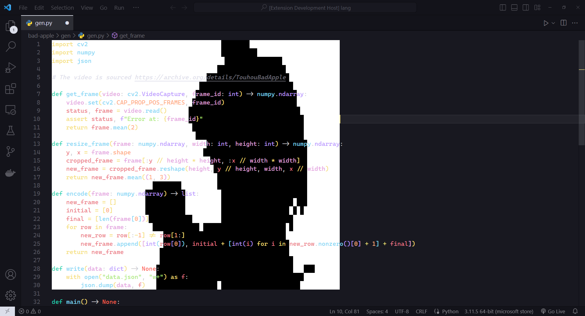

# Bad Apple!! in VS Code

Want Bad Apple!! in VS Code? No? Here it is anyway...

NOTE: For best results, use monospace.

## About

Theme: [Bearded Theme HC Ebony](https://github.com/BeardedBear/bearded-theme)

This extension comes with these commands accessible by the command palette (default is `Ctrl+Shift+P`):
* `Bad Apple!!: Play` - Play Bad Apple!! in your active text editor.
* `Bad Apple!!: Pad` - Pads text so Bad Apple!! can be watched in full.
* `Bad Apple!!: Kill` - Stops all Bad Apple!! instances.

## Extension Settings

This extension contributes the following settings:

* `bad-apple-player.targetFrames`: Target FPS to display Bad Apple!!
* `bad-apple-player.opacity`: Opacity of Bad Apple!!
* `bad-apple-player.textOpacity`: Opacity of text when running Bad Apple!!
* `bad-apple-player.switchEditor`: Whether to switch to the current active editor.

## Known Issues

Currently, this extension is unable to resize for different dimensions.

This extension also works poorly without a monospace font.

## Release Notes

### 0.0.1

Initial release of Bad Apple!! in VS Code.

---

**Enjoy!**
